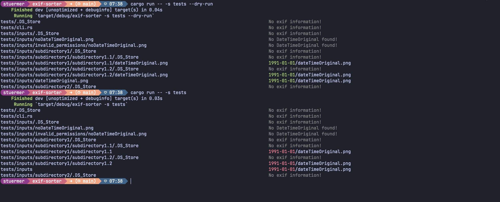

# Exif-tool

[](./LICENSE.md)
[](https://github.com/thebino/exif-sorter/graphs/contributors)


Exif-sorter is a simple tool to read the exif data from images and sort them into sub-directories based on the `DateTimeOriginal` which indicates the date/time when original image was taken.
If this date is not found, the Files modification and creation date can be used instead.

## Usage
```bash
exif-sorter -s unsorted_images -t sorted_images cli
```


> ⚠️⚠️⚠️
> This application is still in Development.
>
> TODOs
> * TUI: trigger search and process
> * TUI: update progress
> * CLI: separate search and process into lib
> * CLI: re-use Image from lib instead of ImageFile in app state




## Cross compile via Docker
Install cross
```shell
cargo install cross --git https://github.com/cross-rs/cross
```


Build w/ cross
```shell
CROSS_CONTAINER_OPTS="--platform linux/amd64" cross build --target x86_64-unknown-linux-musl
```

