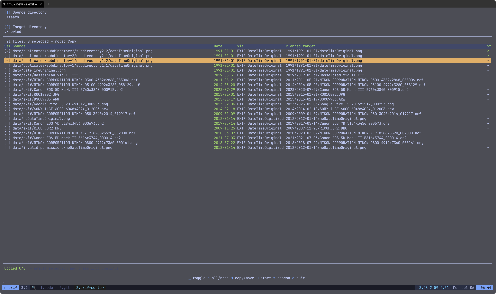
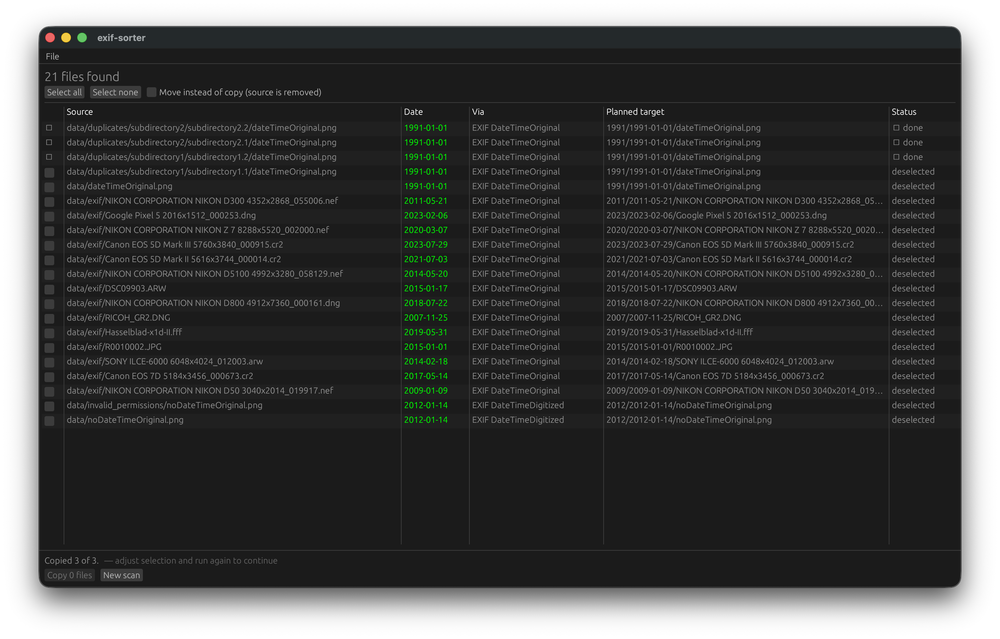

# Exif-sorter

[](./LICENSE.md)
[](https://github.com/thebino/exif-sorter/graphs/contributors)


Exif-sorter reads the metadata of photos and videos and sorts them into date-based sub-directories. Built for cleaning up recovered media (e.g. PhotoRec output), where trustworthy dates are scarce and safety matters.

**Date sources**, tried in order of trust: EXIF `DateTimeOriginal` → `DateTimeDigitized` → `DateTime` → GPS date stamp → MP4/QuickTime creation time → date embedded in the filename (`IMG_20190412_…`, WhatsApp, Signal, …) → file timestamps (flagged low-confidence).

**Safety by default:**
- Files are **copied**, not moved — the source stays untouched unless you pass `--move`.
- Every decision is logged to `{target}/exif-sorter-manifest.csv`; `exif-sorter revert -m <manifest>` undoes a run.
- Files without a usable date land in `{target}/unsorted/`, unrecognizable (carved) content in `{target}/corrupt/` — nothing is silently misfiled.
- Existing files are never overwritten; collisions get a suffix, or use `--on-collision dedupe|skip`.

See the [changelog](./CHANGELOG.md) for release notes.

## Install

Grab a native installer or portable archive from the [latest release](https://github.com/thebino/exif-sorter/releases/latest):

- **Linux**: `.deb` / `.rpm` (or the `x86_64-musl` tarball for a portable CLI)
- **macOS**: `.dmg` (Intel and Apple Silicon builds) — currently unsigned, so on first launch right-click the app → **Open**
- **Windows**: `.msi` — currently unsigned, so click **More info → Run anyway** past the SmartScreen prompt

Or via package managers:

```bash
cargo install exif-sorter          # from crates.io
brew install thebino/tap/exif-sorter
```

## CLI

```bash
exif-sorter -s unsorted_images -t sorted_images cli
exif-sorter -s src -t dst cli --move --on-collision dedupe --pattern "{year}/{month}"
exif-sorter revert -m sorted_images/exif-sorter-manifest.csv
```

Options can also come from `~/.config/exif-sorter/config.toml` (`pattern`, `move`, `on_collision`); command-line flags win.

## TUI

```bash
exif-sorter -s unsorted_images -t sorted_images tui
```

Scan → review → confirm: `s` scans (read-only — nothing is written), the review table shows every file with its detected date, the date's origin and the planned target. Toggle files with `Space` (`a` = all/none), switch copy/move with `m`, confirm with `Enter`. Progress and a summary follow.



## GUI

```bash
exif-sorter
```

Same scan → review → confirm flow with directory pickers, a sortable file table, live progress and a summary. Copy is the default; moving must be enabled explicitly.



## Cross compile via Docker
Install cross
```shell
cargo install cross --git https://github.com/cross-rs/cross
```


Build w/ cross
```shell
CROSS_CONTAINER_OPTS="--platform linux/amd64" cross build --target x86_64-unknown-linux-musl
```
